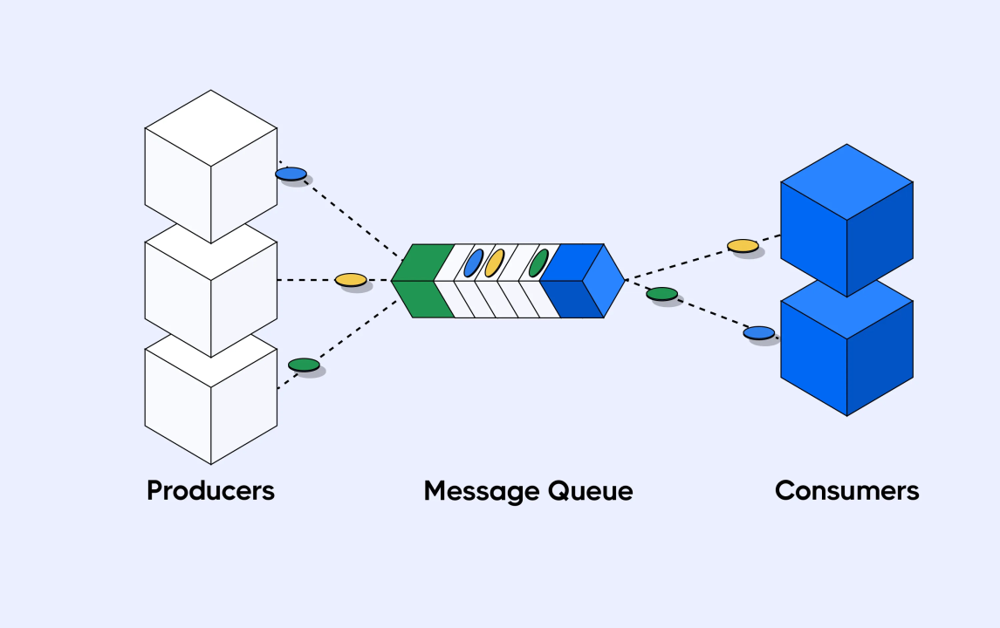

---

#  **Notification Queue System**



A Notification Queue System allows you to handle **emails**, **SMS**, **push notifications**, and **heavy background tasks** asynchronously and reliably using **queues**, **workers**, **retries**, and **dead-letter queues**.

This README provides a complete overview of **core concepts**, **architecture**, and **implementation patterns** using **BullMQ**.

---

#  **Why Use a Queue for Notifications?**

Queues solve several problems in real-world systems:

* Avoid blocking the API during slow tasks
* Handle heavy workloads (emails, SMS, bulk ops)
* Protect external APIs from overload
* Provide retry & failure handling
* Enable scalable, asynchronous processing

If your system sends notifications or heavy jobs, a queue is REQUIRED for performance and reliability.

---

#  **Core Messaging Components**

## **1. Queue**

A FIFO buffer where jobs wait to be processed by workers.

## **2. Exchange / Routing (RabbitMQ concept)**

Decides how messages travel from producers to queues (Direct, Topic, Fanout).

## **3. Routing Keys**

Labels used to route messages to the correct queue.

## **4. Bindings**

Links between exchange and queue using routing keys.

## **5. Virtual Hosts**

Isolated environments inside message broker.

## **6. Channels**

Lightweight connection lanes used by producers/consumers.

---

#  **Worker-Based Architecture**

### Producer

Creates a job and pushes it into the queue (fast, non-blocking).

### Queue

Stores jobs until worker consumes them.

### Worker

Processes jobs asynchronously and returns results using ACK/NACK.

### Scheduler

Handles delayed jobs, job retries, and stalled job detection.

---

#  **Message Delivery Concepts**

### ✔ Push Model

Broker pushes messages to workers instead of workers pulling.

### ✔ Prefetch

Controls how many unacked jobs a worker can receive at once (prevents overload).

### ✔ ACK/NACK

* **ACK** → job done
* **NACK** → job failed → retry

### ✔ Persistent Messages

Messages survive broker crashes.

### ✔ Durable Queues

Queue definition survives restart.

---

# **Retry Logic**

### **Fixed Retry**

Retry after a fixed delay (e.g., every 5 seconds).

### **Exponential Retry**

Delay doubles each retry
(3s → 6s → 12s → 24s → …)
Best for external APIs (email/SMS).

### **Max Attempts**

Limit total retries to prevent infinite loops.

### **Permanent Failures**

After max attempts → send job to DLQ.

---

# **Dead-Letter Queue (DLQ)**

DLQ stores jobs that **cannot be processed** due to:

* Max retries exceeded
* Invalid payload
* Timeout
* Worker crash
* Expired TTL

### Why DLQ?

✔ No message lost
✔ Easy debugging
✔ Ability to reprocess later
✔ Failure isolation

### DLQ Analysis:

* Check error reason
* Check attempts count
* Identify patterns
* Categorize failures (permanent vs temporary)

### Reprocessing DLQ Jobs:

* Manual requeue
* Automatic retry worker
* Conditional reprocessing
* Batch processing

---

#  **Message TTL & Delayed Jobs**

### Message TTL

Message expires after a certain time (e.g., OTP valid only 60 sec).

### Delayed Jobs

Run job after a delay (e.g., send reminder after 10 minutes).

Used for:

* Order cancellation timers
* Reminder notifications
* Retry backoff
* Scheduled tasks

---

#  **Repeatable Jobs (Cron Jobs)**

Using BullMQ, you can schedule jobs like:

```cron
0 6 * * *   // every day 6 AM
```

Used for:

* Daily emails
* Cleanup tasks
* Regular reminders

---

#  **Rate Limiting**

Controls how many jobs can be processed per second for safety.

Useful for:

* SMS providers
* Email APIs
* Webhooks

Prevents throttling, failures & backpressure.

---

#  **Job Priorities**

Process **important jobs first**:

* Priority 1 → OTP / Password reset
* Priority 10 → Marketing emails

Bulks will not block priority notifications.

---

#  **Flow Producer (Dependent Jobs)**

Used to create **multi-step workflows**, such as:

```
Generate PDF → Upload PDF → Email PDF
```

Supports:

* Parent-child jobs
* Parallel branches
* Complex pipelines

---

#  **Backpressure & Queue Overflow**

### Backpressure

When jobs come faster than workers can process.

### Queue Overflow

Queue becomes too large → system slowdowns, failures.

Solutions:

* Worker scaling
* Prefetch tuning
* Rate limiting
* Priority queues
* Retry backoff
* DLQs

---

#  **BullMQ Job Lifecycle**

```
waiting → active → completed
           ↓
        failed → retry → DLQ
```

* **waiting** → queued
* **active** → being processed
* **completed** → done
* **failed** → retry or DLQ
* **stalled** → worker crash → retry

---

#  **Basic Implementation Snippets**

### Producer

```js
queue.add("sendEmail", data, {
  attempts: 5,
  backoff: { type: "exponential", delay: 3000 },
  timeout: 5000,
});
```

### Worker

```js
new Worker("emailQueue", async (job) => {
  console.log("Processing", job.id);
  // send email logic...
});
```

### Queue Scheduler

```js
new QueueScheduler("emailQueue");
```

### Move failed job to DLQ

```js
worker.on("failed", async (job, err) => {
  await dlq.add("failed-email", {
    ...job.data,
    reason: err.message,
  });
});
```

---

#  **Best Practices for Production**

✔ Always use exponential retries
✔ Always configure DLQ
✔ Use concurrency for high throughput
✔ Add rate limiting for external APIs
✔ Prefer durable queues + persistent messages
✔ Ensure workers are idempotent
✔ Use separate queues for different workloads
✔ Monitor queue depth + DLQ size
✔ Use BullMQ dashboard tools

---

# 🏁 **Conclusion**

A Notification Queue System built with BullMQ provides:

* **Scalability**
* **Fault-tolerance**
* **High performance**
* **Clean separation of concerns**
* **Automatic retries**
* **Failure isolation with DLQ**
* **Flexible scheduling & workflows**

This architecture is used in production by:

* Email systems
* SMS delivery
* Background processing
* Payment pipelines
* E-commerce systems
* Notification platforms

---

